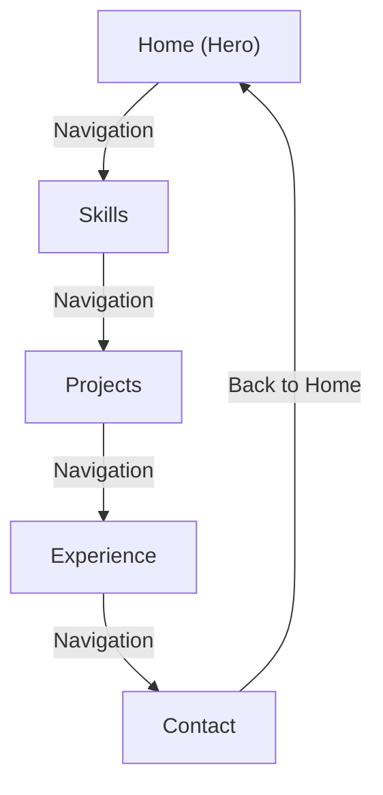

# Portfolio Website

A simple, responsive static portfolio website showcasing personal projects, skills, and experience.

## Table of Contents
- [Features](#features)
- [Technology Stack](#technology-stack)
- [Project Structure](#project-structure)
- [Setup & Development](#setup--development)
- [Navigation Flow Diagram](#navigation-flow-diagram)
- [License](#license)

## Features
- Single‑page layout with smooth scrolling navigation.
- Sections: **Home**, **Skills**, **Projects**, **Experience**, **Contact**.
- Fully responsive design using CSS Grid/Flexbox.
- Dark‑mode‑friendly color palette and custom fonts from Google Fonts.
- Interactive cursor effect and mobile‑friendly hamburger menu.

## Technology Stack
- **HTML5** – semantic markup.
- **CSS3** – custom styles, animations, responsive layout.
- **JavaScript** – optional for UI enhancements (cursor, menu toggle).
- **Google Fonts** – `Cormorant Garamond`, `JetBrains Mono`, `Syne`.

## Project Structure
```
portfolio/
├─ index.html        # Main entry point – contains all sections
├─ style.css         # All styling (layout, colors, animations)
└─ README.md        # This documentation
```

The `index.html` file defines the following sections (identified by IDs):
- `hero`
- `skills`
- `projects`
- `experience`
- `contact`

These IDs are linked from the navigation menu for smooth scrolling.

## Setup & Development
1. **Clone the repository**
   ```bash
   git clone <repo-url>
   cd portfolio
   ```
2. **Open `index.html`** in a browser – no build step required.
3. **Edit content** – modify the HTML to update your personal information, projects, etc.
4. **Style tweaks** – adjust `style.css` for colors, fonts, or layout changes.
5. **Deploy** – host the folder on any static web host (GitHub Pages, Netlify, Vercel, etc.).

## Navigation Flow Diagram

The diagram visualises the single‑page navigation flow where each menu link scrolls to its respective section.

## License
This project is licensed under the **MIT License** – see the `LICENSE` file for details.

---

<div align="center">
  <sub>Made by <a href="https://github.com/sridharSTR">sridhar manoharan</a></sub>
</div>

